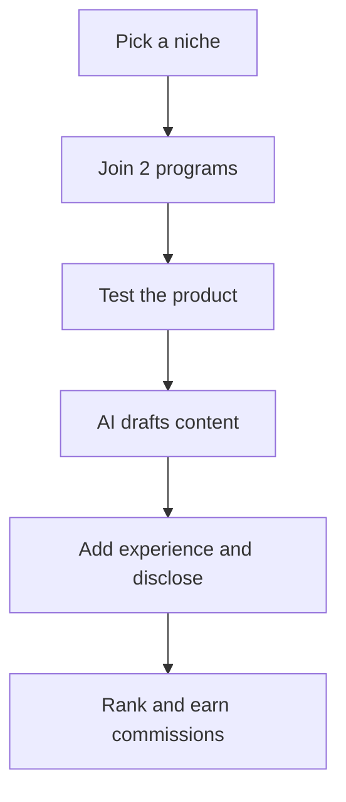

Affiliate marketing has a reputation for being either dead or a get-rich-quick scheme, depending on who you ask. Neither is accurate. **Done right, it is one of the most durable passive income models available** — and AI has made it meaningfully more accessible for beginners, mostly by removing the content production bottleneck.

This playbook covers what actually works in 2026: honest product recommendations, search-optimized content, and a sustainable publishing pace.

---

## The affiliate workflow at a glance

Here is how the pieces fit together, from picking a niche to earning commissions.



---

## Step 1: Pick a niche you can be useful in

The single biggest mistake beginners make is picking a niche because of its commission rates, not because they have anything useful to say about it.

**Why this matters:** Google's Helpful Content updates reward first-hand experience and genuine expertise. A niche blogger who has actually used the tools they recommend outranks a generic "best of" site every time.

**How to choose well:**

| Question | What a good answer looks like |
| --- | --- |
| Do you use products in this space? | Yes — you have opinions, preferences, things that annoy you |
| Can you write 50 posts on this topic? | Yes — you can think of subtopics immediately |
| Do buyers in this niche spend money? | Yes — SaaS tools, physical products, courses, services |
| Is there existing search demand? | Yes — you can find related searches in Google autocomplete |

**High-commission niches that work well with AI content:**
- Software (SaaS tools often pay 20-40% recurring commissions)
- Online education (courses and cohort programs)
- Finance and investing (high CPC, competitive but large)
- Creator tools (email marketing, design, video)

---

## Step 2: Find the right affiliate programs

Before you write a word, confirm you have a path to commissions.

**Where to look:**
- **Direct programs:** Most SaaS companies have an affiliate page at `/affiliates` or `/partners`. Often higher commissions than networks.
- **ShareASale, Impact, PartnerStack:** Curated networks with thousands of programs. PartnerStack is particularly strong for B2B software.
- **Amazon Associates:** Low commissions (1-4%) but universal product coverage. Good as a supplemental program, not a primary one.

**What a good program looks like:**
- 20%+ commission on recurring subscriptions, OR a flat fee of $50+ per conversion
- 30+ day cookie window
- Monthly payouts with a low threshold ($25-50)
- Accessible affiliate manager if you grow

---

## Step 3: Use AI to produce content that actually ranks

The content types that drive affiliate revenue are comparison posts, tutorials, and "best for X" roundups. These have clear search intent and convert well.

**How to use AI correctly for affiliate content:**

AI is excellent at structure and first drafts. It is bad at first-hand experience. The winning workflow:

```steps
1. **Test the product** yourself — even a free trial gives you real observations AI cannot fabricate
2. **Write bullet notes** on what you observed — pros, cons, quirks, who it suits
3. **Have AI turn your notes into a structured draft** — intro, feature breakdown, comparison table, verdict
4. **Add screenshots, specific numbers, and your opinion** to make it useful rather than generic
```

::: tip
The order matters. Testing the product *before* you prompt AI is what separates content that ranks from content Google flags as thin. Your first-hand notes are the one thing a competitor cannot copy.
:::

**Templates worth using:**

*For a comparison post:*
> "I'm writing a comparison of [Tool A] vs [Tool B] for [target audience]. Here are my notes from testing both: [paste notes]. Write a 1,200-word comparison with an intro, a feature-by-feature table, a section on who each tool is best for, and a verdict."

*For a roundup post:*
> "Write a 1,500-word 'best tools for [X]' post covering [5 tools]. Structure: intro with the evaluation criteria, then one H2 per tool covering what it does, who it's for, pricing, and pros/cons."

---

## Step 4: Optimize for search intent

Affiliate content lives or dies by whether it matches what searchers actually want when they type a query.

**The three intents that convert:**

| Search intent | Example query | Content type |
| --- | --- | --- |
| Comparison | "Notion vs Obsidian" | Head-to-head comparison with verdict |
| Best of | "best project management tools" | Curated roundup with clear criteria |
| Review | "Jasper AI review" | Single tool deep-dive |

**Internal linking strategy:** Each review and comparison post should link back to your roundup posts, and your roundup posts should link to deep-dive reviews. This creates a cluster that Google treats as topical authority.

---

## Step 5: Disclose and stay compliant

Affiliate disclosures are legally required in most countries and morally required everywhere. They also do not hurt conversions — readers respect transparency.

::: warning
Disclosure is not optional. In most countries an undisclosed affiliate relationship can expose you to legal liability, and a single deceptive post can unravel an audience you spent years building. Disclose at the top of every post that contains affiliate links.
:::

**What to do:**
- Add a brief disclosure at the top of every post that contains affiliate links: *"This post contains affiliate links. If you buy through a link, I may earn a commission at no extra cost to you."*
- Add a dedicated Affiliate Disclosure page to your site footer.
- Never imply you tested something you did not test.

**What to avoid:**
- Fake reviews or fabricated results ("I earned $10,000 in one month!")
- Hiding the affiliate relationship
- Recommending products you would not personally use

Trust compounds over years. A single deceptive post can unravel an audience you spent two years building.

---

## Realistic timeline and income expectations

| Month | Focus | Realistic outcome |
| --- | --- | --- |
| 1-2 | Site setup, first 10 posts | $0 — Google indexing delay |
| 3-4 | 20-30 posts live | First clicks, maybe $10-50 |
| 5-6 | Topical authority building | $100-300/mo if niche has traction |
| 9-12 | Consistent publishing | $500-2,000+/mo for focused sites |

These ranges assume: real products, honest reviews, consistent publishing (2-4 posts/week), and a niche with active buyer intent.

---

## Frequently asked questions

**Do I need a huge audience to make affiliate income?** No. A small, targeted audience searching for exactly what you review converts far better than a large, general one. 500 monthly visitors from buyer-intent searches outperform 10,000 casual readers.

**Can AI write my entire affiliate post?** It can write a first draft, but a pure AI post without first-hand experience will not rank competitively in 2026. Google's systems are calibrated to detect thin, experience-free content.

**Which affiliate programs pay the most?** SaaS tools with recurring commissions — you earn every month the customer stays subscribed. ConvertKit, Teachable, and most project management tools run programs in this model.

---

## The bottom line

Affiliate marketing is not passive on day one. It is active content production for 6-12 months, after which traffic compounds and earnings become increasingly passive. AI reduces the content production cost significantly — but it does not replace genuine experience, honest opinions, or consistent publishing.

Pick one niche, join two programs, publish two posts this week.

*See also: [How to Make $500/Month with an AI Blog](/blog/how-to-make-500-month-with-an-ai-blog-realistic-guide) | [SEO for Beginners: How to Rank Your First Blog Post](/blog/seo-for-beginners-how-to-rank-your-first-blog-post-on-google)*
