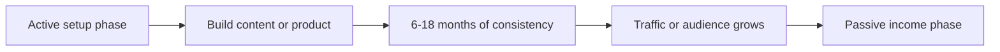

"Passive income with AI" is either the most overhyped phrase on the internet or a real strategy, depending on what you think "passive" means.

Here is the honest version: **nothing is passive on day one**. Every passive income stream requires active setup, and most require 6-18 months of consistent work before the passive part kicks in. What AI does is dramatically reduce the upfront labor, which makes those 6-18 months more sustainable for a solo creator.

This guide covers the three passive income models that actually work with AI tools in 2026, what tools to use for each, and what realistic income looks like.

---

## The passive income workflow at a glance

Whichever model you choose, the path from setup to passive runs through the same stages:



::: note
The "passive" label describes the final state, not the beginning. Every box before the last one is active work — AI just shrinks how long each takes.
:::

---

## Model 1: Content-based passive income (blogs and YouTube)

**How it works:** You publish helpful content, it ranks in search, and you earn ad revenue and affiliate commissions long-term. A post published today can still earn money 3 years from now.

**Why AI helps:** Content production is the bottleneck. AI compresses a 5-hour writing day into 2 hours, which means you can publish more consistently without burning out.

**The AI tools that matter for content:**

| Tool | Role | Cost |
| --- | --- | --- |
| Claude or ChatGPT | Writing first drafts and outlines | Free tier available |
| Surfer SEO / NeuronWriter | On-page SEO optimization | $29-89/mo |
| Canva | Blog headers and social graphics | Free tier available |
| CapCut | Short-form video from blog content | Free |

**Realistic income timeline:**

| Month | What's happening | Income range |
| --- | --- | --- |
| 1-3 | Publishing 2-4 posts/week, building index | $0 |
| 4-6 | Google traffic starting, first rankings | $50-200 |
| 9-12 | Compounding traffic, affiliate conversions | $300-1,500 |
| 18-24 | Established site with authority | $1,000-5,000+ |

**The catch:** Content passive income requires consistent publishing for the first 6-12 months. If you publish 20 posts and stop, the site stagnates. The passive phase begins once you have enough content indexed to generate ongoing traffic without constant new publishing.

---

## Model 2: Digital products (e-books, templates, mini-courses)

**How it works:** You create a product once, list it on a marketplace, and earn every time someone buys — with no shipping, inventory, or customer service beyond the initial setup.

**Why AI helps:** What used to take weeks to create (a 50-page ebook, a spreadsheet template set, a mini-course curriculum) now takes days. AI handles structure and first drafts; you add the expertise and specifics.

**The AI tools that matter for digital products:**

| Tool | Role | Cost |
| --- | --- | --- |
| Claude or ChatGPT | Ebook drafts, curriculum outlines | Free |
| Canva | Ebook design, slide decks, template design | Free |
| Loom | Video walkthroughs for courses | Free tier |
| Gumroad or Lemon Squeezy | Sell products (no monthly fee) | % of sales |

**What sells well as a digital product:**

- **Prompt libraries** — curated AI prompts for a specific profession (e.g., "50 ChatGPT prompts for real estate agents")
- **Workflow templates** — Notion databases, spreadsheet systems, process docs
- **Mini e-books** — 30-50 pages answering one specific question in depth
- **Email swipe files** — templates for a specific use case

**Realistic income timeline:**

Digital products can earn faster than content if you have an existing audience (even a small one). Without an audience:

| Scenario | Expected result |
| --- | --- |
| No audience, listed on Gumroad | $0-50/mo — discoverability is low |
| Small email list (500+) | $200-500/mo from launches |
| SEO-driven traffic to product page | Scales with content traffic; 3-6 month lag |

The fastest path: build a small email list first (even 200 subscribers), launch to them, then use the social proof to market the product more broadly.

---

## Model 3: AI automation services (sold as productized subscriptions)

**How it works:** You build a repeatable AI workflow for a client — content repurposing, lead research, report generation — and charge a monthly fee to maintain and run it. The work reduces to a few hours per client per month once the workflow is built.

**Why AI helps:** Workflows that used to require a team of 3 can now be automated by a solo operator with AI tools. You build once, sell multiple times.

**The AI tools that matter for automation:**

| Tool | Role | Cost |
| --- | --- | --- |
| Make (formerly Integromat) | Connect apps and automate workflows | Free tier; $9+/mo |
| Claude API or OpenAI API | Process text at scale inside workflows | Pay per token |
| Zapier | Simpler automations | Free tier; $19+/mo |
| Airtable | Store and organize automated data | Free tier |

**What businesses actually pay for:**

- **Content repurposing:** Turn blog posts into 10 social posts automatically ($200-500/mo)
- **Lead research:** AI scrapes and enriches a prospect list weekly ($300-800/mo)
- **Report generation:** Pull data from multiple sources into a formatted PDF report monthly ($400-1,000/mo)

**Realistic income timeline:** This model has the shortest path to income but the highest active involvement upfront. Expect 1-3 months to find and close first clients, then 60-90% of the monthly recurring revenue becomes passive once the automation is built and tested.

---

## Which model is right for you?

| If you... | Choose |
| --- | --- |
| Have writing skills and patience | Content blog (longest runway, most passive long-term) |
| Have expertise in a specific field | Digital products (fastest income if you have an audience) |
| Have a technical or systems mindset | Automation subscriptions (fastest path to recurring income) |

You do not have to pick just one — many creators run a blog that sells digital products and includes affiliate links to tools. But start with one and add the others after the first is generating revenue.

::: tip
A blog pairs naturally with digital products and affiliate links. If you are unsure where to start, the content blog gives you the widest set of options to expand into later.
:::

---

## Quick-start checklist

Use this to go from zero to a running passive income setup:

```steps
1. Pick **one** model that matches your skills and patience.
2. Choose the core AI tools for that model (writing, design, or automation).
3. Build your first asset — a post, a product, or a workflow.
4. Stay consistent through the 6-18 month setup window.
5. Add a second model only after the first generates revenue.
```

---

## Frequently asked questions

**Is passive income with AI realistic for a complete beginner?** Yes, but expect 6-12 months before meaningful income. The tools lower the barrier to entry; they do not eliminate the need for consistency.

**Which AI tools are most important to learn first?** Claude or ChatGPT for writing, and either Make or Zapier for automation. These two skill areas cover 80% of the passive income models above.

**Can I run all three models at once?** Theoretically yes, but practically it fragments your effort. Pick one, generate income from it, then expand.

---

## The bottom line

Passive income with AI is real — but "passive" is a description of the long-term state, not the starting point. The AI tools available in 2026 make the setup phase faster and more manageable for solos and beginners than at any point before.

Choose one model. Work it for 90 days before evaluating. The first 90 days of any passive income stream look like active income work — that is normal, and it is temporary.

*See also: [How to Make $500/Month with an AI Blog](/blog/how-to-make-500-month-with-an-ai-blog-realistic-guide) | [AI Affiliate Marketing: A Beginner's Playbook](/blog/ai-affiliate-marketing-a-beginner-s-playbook)*
