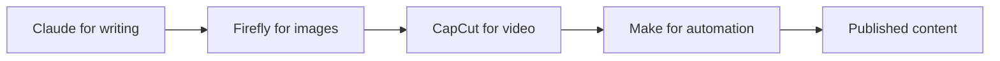

Paid AI tools get all the attention, but the free tiers available in 2026 are genuinely powerful — powerful enough to run a content business, launch digital products, and automate your workflow without spending a dollar until you have revenue to justify it.

This is a curated list of what's actually free (not "free trial" or "free with credit card"), what each tool does well, and where the free tier runs out.

---

## The free-tool workflow at a glance

The trick with free tiers is stacking them so each covers a different stage of the work:



::: info
No single free tier does everything well. The leverage comes from chaining specialized free tools, not from finding one tool that covers the whole pipeline.
:::

---

## Free AI writing tools

### Claude.ai (free tier)
**What you get:** Claude 3.5 Sonnet access with a daily message limit. Strong long-form writing, analysis, and coding.

**Best for:** Writing blog posts, editing drafts, summarizing documents, brainstorming.

**Free tier limit:** A message cap that resets daily. For most bloggers publishing 3-5 posts per week, it is enough.

**Where it runs out:** High-volume content production (10+ pieces/day) or very long documents in a single session.

### ChatGPT (free tier)
**What you get:** GPT-4o access with usage limits. Includes image understanding and voice.

**Best for:** Research, Q&A, quick drafts, and tasks where you need to paste images.

**Free tier limit:** Slower speeds during peak hours; limited GPT-4o usage before throttling to GPT-3.5.

### Notion AI (free with Notion free plan)
**What you get:** AI writing and editing built into your notes and documents. Limited AI responses per month.

**Best for:** Writing and editing directly inside your workspace without switching apps.

---

## Free AI image tools

### Adobe Firefly (free tier)
**What you get:** 25 generative credits per month on the free plan.

**Best for:** Generating blog header images, product mockups, and social media graphics.

**Commercial use:** Yes — Adobe Firefly is trained on licensed content, so the free output is commercially safe.

**Free tier limit:** 25 credits goes fast if you generate many variations. Good for 8-15 usable images per month.

### Canva (free tier with Magic tools)
**What you get:** Magic Write (AI text in designs), background removal, and basic image generation.

**Best for:** Social media graphics, YouTube thumbnails, blog headers — anything that needs design plus text.

**Note:** Canva's AI features are more limited on the free plan than the paid, but still useful for templated designs.

### Leonardo.ai (free tier)
**What you get:** 150 tokens per day (~30 image generations).

**Best for:** More artistic or stylized images than Firefly. Great for faceless YouTube channel thumbnails.

---

## Free AI audio and video tools

### Otter.ai (free tier)
**What you get:** 300 minutes of transcription per month, AI meeting summaries.

**Best for:** Transcribing voice notes into blog content, summarizing meetings.

**A workflow that works well:**

```steps
1. Record yourself talking through your ideas for **10 minutes**.
2. Transcribe the recording with `Otter`.
3. Clean up the transcript with `Claude`.
4. Publish — the result sounds more authentic because the raw ideas are yours.
```

### CapCut (free)
**What you get:** AI auto-captions, background removal, and video editing — fully free.

**Best for:** Short-form video content for TikTok, Reels, and Shorts. Auto-captions alone save hours of manual work.

### Descript (free tier)
**What you get:** 1 hour of transcription per month, basic AI editing.

**Best for:** Podcasters who want to edit audio by editing text.

---

## Free AI automation tools

### Make (free tier — 1,000 operations/month)
**What you get:** Automate connections between apps. 1,000 operations per month resets monthly.

**Best for:** Connecting your blog CMS to social media, routing form submissions to email, syncing data between tools.

**Example automation:** When you publish a new post in Ghost → Make automatically creates a tweet thread and a LinkedIn post.

### Zapier (free tier — 100 tasks/month)
**What you get:** 100 tasks per month across unlimited Zaps.

**Best for:** Simple two-step automations. Fewer operations than Make but an easier interface.

**Free tier limit:** 100 tasks disappears quickly for high-volume automations. Best for low-frequency triggers.

---

## How to get the most from free tiers

**Stack tools.** Use Claude for writing, Firefly for images, CapCut for video. Each free tier covers a different part of the workflow.

**Know your daily allowances.** Most free tiers reset daily or monthly. Plan your work around resets — do image generation at the start of the day before you burn through credits.

**Upgrade surgically.** Once a specific tool becomes your bottleneck — you are hitting limits every day — that is when upgrading it pays off. Do not upgrade everything at once.

::: warning
Free tiers reset on different schedules — some daily, some monthly. Burning Firefly's 25 monthly credits in one afternoon means waiting until next month, so spread heavy generation across the cycle.
:::

---

## Frequently asked questions

**Are these tools actually free or is it a trial?** Every tool on this list has a real free tier that does not expire. Some have paid upgrades, but the free version persists indefinitely.

**Can I use free AI tool output commercially?** It depends on the tool. Adobe Firefly free output is commercially safe. Some image generators have restrictions — always check the terms before selling anything.

**What is the best free AI tool for a complete beginner?** Start with Claude.ai for writing and Canva for visuals. Both are free, both have simple interfaces, and together they cover 80% of what a content creator needs.

---

## The bottom line

You can run a real AI-powered content business on free tools alone for your first 3-6 months. The free tier is good enough to validate demand, build an audience, and start earning — upgrade only when a specific tool's limits are the actual bottleneck.

*See also: [How to Start an AI Blog That Ranks on Google](/blog/how-to-start-an-ai-blog-that-ranks-on-google) | [ChatGPT vs Claude vs Gemini: Which AI is Best for Making Money?](/blog/chatgpt-vs-claude-vs-gemini-which-ai-is-best-for-making-money)*
