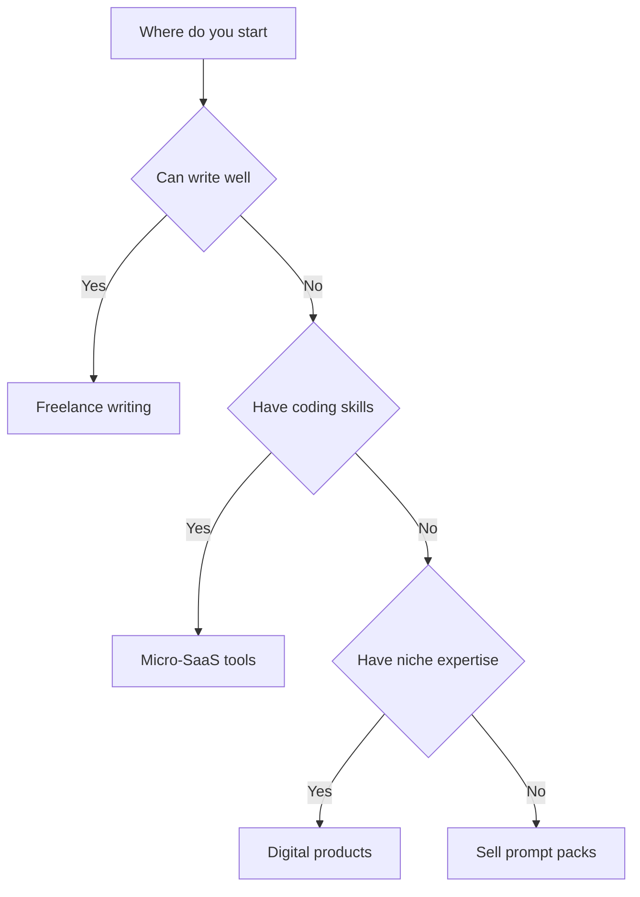

I have been testing ChatGPT for income since GPT-3.5, and here is what I found: most people overthink this. They search for weeks, buy courses, and never actually start. So I am skipping the fluff and giving you exactly what I would tell a friend — the ten methods I have seen work, ranked by how fast a complete beginner can go from zero to their first dollar.

> Quick note before we dive in: every serious earner I know runs 3–5 streams simultaneously. Not one. If you only pick one method, pick the one that plays to your existing skills — then add a second when the first is running on autopilot.

## How to choose your first method at a glance

Not sure where to begin? This decision flow maps your starting skill to the fastest method for you.



::: tip
Pick the one method that plays to your existing skills today, then add a second stream once the first runs on autopilot. Momentum beats optimization.
:::

## 1. Freelance writing — the fastest path to cash

This is the one I recommend to anyone who can string together a decent sentence. Companies are hiring writers who know how to use AI tools, not replacing writers with AI. I have seen beginners go from zero to their first $500 month in about 6 weeks doing this.

What actually works: pick one niche (I started with AI tools for small businesses), use ChatGPT to handle the research and outline, then rewrite everything in your own voice. Clients pay for your perspective, not for words. A writer who specializes in a niche earns 3–5x what a generalist earns.

Where to start: Upwork, LinkedIn, or cold emailing agencies that serve your niche. Lead with a sample post, not a generic cover letter.

## 2. Sell prompt packs — easier than you think

There is a real market for well-tested prompts. Businesses and creators know AI saves time, but most of them are terrible at writing prompts. They will pay $10–$50 for a pack of 20 prompts that actually work.

I have seen prompt packs on PromptBase, Gumroad, and Etsy. The ones that sell best are niche-specific — "50 ChatGPT prompts for real estate agents" does better than "100 general productivity prompts." The trick is testing each prompt yourself before you bundle it. One broken prompt in a paid pack will get you refund requests.

::: warning
Test every prompt yourself before you bundle it. One broken prompt in a paid pack will get you refund requests and tank your reviews.
:::

## 3. YouTube scriptwriting

Here is something most people miss: YouTubers are desperate for good scripts. They want to focus on filming and editing, not researching and outlining. A well-researched 10-minute script is worth $50–$150 to a creator making videos 3x a week.

I use ChatGPT to speed up the research phase — find recent stats, pull competitor video structures, suggest hooks — then write the actual narrative myself. The best way to land clients is to script 2–3 sample videos for a channel you watch, then reach out to the creator with a cold email showing exactly what you made for them.

## 4. Digital products (ebooks, templates, checklists)

Creating a digital product used to take weeks. With ChatGPT handling structure and first drafts, I can go from idea to a finished 40-page ebook in about 3 days. Price it at $9–$29 and list it on Gumroad, Etsy, or your own site.

The products that actually sell: workflow templates (Notion databases, Excel sheets), email swipe files, checklists for specific tasks. Anything that saves the buyer time works. The key insight I learned the hard way: validate the idea before you build. Ask your existing audience (even a tiny one) what they would pay for, then build exactly that.

## 5. Build a niche newsletter

Newsletters are making a comeback because they bypass algorithm risk. You own the list. Pick a narrow topic — I have seen profitable newsletters on AI for landlords, ChatGPT prompts for real estate agents, AI tools for therapists — and curate useful content 2–3 times a week.

Use ChatGPT to summarize industry news, extract key insights from long reports, and draft the newsletter copy. Monetize with sponsorships once you hit 1,000 subscribers. The going rate for a niche B2B newsletter is $50–$200 per sponsored send at 1,000–5,000 subscribers.

## 6. Affiliate content with AI assistance

This is the method with the longest runway but the highest ceiling. Build a blog around a commercial niche, use AI to help produce content faster, and earn commissions when people buy through your links. I cover this in detail in my [AI affiliate marketing playbook](/posts/ai-affiliate-marketing-a-beginner-s-playbook/).

The method: write comparison posts and "best for X" roundups, add your genuine experience with each tool, and link to them using affiliate programs. SaaS tools pay 20–40% recurring commissions, which compounds beautifully as you publish more content.

## 7. AI workflow consulting for small businesses

Small business owners know they should be using AI. Most of them have no idea where to start. You can charge $200–$500 to audit their workflow and set up automations using Make or Zapier with ChatGPT under the hood.

The setup takes 2–4 hours per client once you know what you are doing. Retainers of $200–$500/month for maintenance and updates turn this into recurring income. I have seen freelancers build this into a full-time income within 3–4 months.

## 8. Social media content repurposing

This is almost free money if you already create long-form content. Use ChatGPT to turn one blog post into 5–10 social media posts, tweet threads, LinkedIn articles, and Instagram captions. Charge businesses $300–$500/month to repurpose their existing content across channels.

The workflow: paste the blog post into ChatGPT, ask for 5 social variants in different tones (professional for LinkedIn, casual for Twitter, visual-first for Instagram), review and tweak, schedule with a tool like Buffer or Hootsuite. Total time per client: about 2 hours/month once the templates are built.

## 9. Build and sell micro-SaaS tools

If you have basic coding skills (or can prompt ChatGPT to write the code), micro-SaaS is a goldmine. Build a simple tool that solves one specific problem — an AI meeting notes summarizer, a ChatGPT-powered email responder, a social media caption generator — and charge $9–$29/month.

The key is finding a pain point you have experienced yourself. I built a simple AI tool that summarizes long email threads because I was drowning in inbox noise. It took 2 days with ChatGPT writing most of the code. Small, focused tools beat big, ambitious ones every time.

## 10. AI-powered online courses

Create and sell a course teaching others how to use AI in a specific field. The market for "AI for X" courses is exploding because everyone is anxious about being left behind. A 5-module video course priced at $49–$149 sells well if it solves a real problem.

Use ChatGPT to outline the curriculum, draft the script for each module, and create quiz questions. Film yourself (or use screen recording) walking through actual workflows. The courses that sell best are practical, not theoretical — show someone exactly what buttons to click.

## Quick-start checklist

If you only do one thing after reading this, do this — pick a method and take the first concrete action today.

```steps
1. **Pick one method** from the ten above that plays to your existing skills.
2. **Set up your free tools** — a ChatGPT account, and a Gumroad or Upwork profile if relevant.
3. **Create one sample** — a writing sample, a prompt pack, or a product mockup to show prospects.
4. **Reach out or list it** — cold email three prospects or publish your first product.
5. **Add a second stream** once the first is running on autopilot.
```

## Frequently asked questions

**How long does it realistically take to earn money?**

From what I have seen and experienced: 2–4 weeks to set everything up, 1–3 months to land your first client or sale, and 3–6 months to reach $100+/month consistently. The people who make it past month 3 are the ones who stick with one method instead of bouncing between ten.

**Do I need to invest any money to start?**

No. ChatGPT has a free tier. GitHub Pages is free. Google Search Console is free. The only thing you might spend on is a domain name ($10–$15/year). I would not pay for any tools until you have made at least $100.

**Which method should I start with?**

Freelance writing if you want the fastest path to cash. Affiliate content if you want long-term passive income. Digital products if you have expertise in a specific area. Pick the one that feels easiest to start today — momentum beats optimization.

## The bottom line

The difference between people who make money with ChatGPT and people who read about it is one thing: they started. Not with the perfect method, not with the perfect setup — just with one post, one client, one product. I have seen too many people spend months researching and zero months doing. Pick one method from this list, take one action today, and see what happens.

*Last updated: 2026-06-17. I update this post as tools and methods evolve.*
