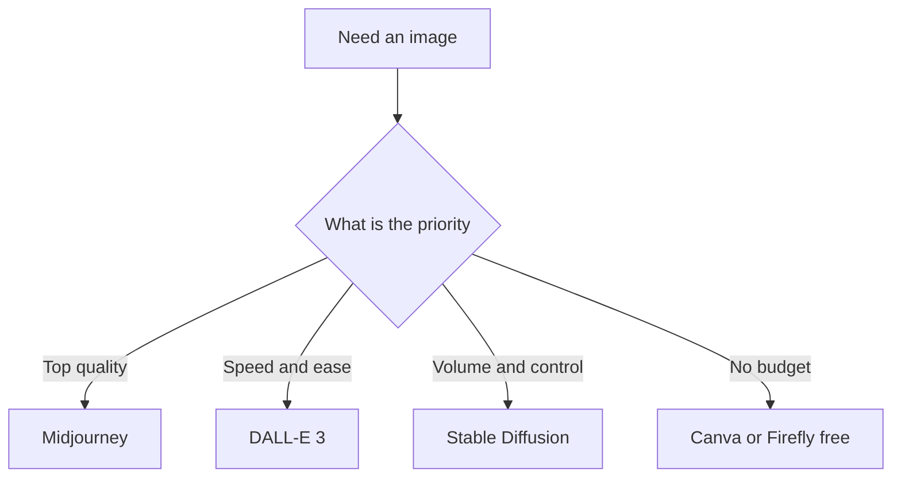

I have been testing AI image generators for my blog content for about 6 months now, and here is the short version: there is no single best tool. Each one has a specific use case where it shines, and picking the wrong one will cost you either quality or money. Let me break down what I actually use each one for.

## How to choose at a glance

If you only remember one thing from this comparison, make it this decision flow:



## Why this matters for bloggers

Your blog images matter more than most people think. A good featured image increases click-through rate from search results by 30% or more. Social media thumbnails with strong visuals get 2x the engagement. And AI image tools have gotten good enough in 2026 that you do not need a designer or a stock photo subscription to produce professional-looking visuals.

The catch: each tool has different strengths, and the free tiers have meaningful limits.

## Midjourney — best for artistic and editorial images

Midjourney is still the king of visual quality, but it has quirks that matter.

**What it does well:** The images look the most "professional" of the three. If you want a cinematic blog header or an editorial-quality illustration for a featured image, Midjourney delivers. The style is distinctive — slightly moody, highly detailed, well-composed.

**What frustrates me:** It is the hardest to use effectively. You need to learn prompt engineering to get consistent results. The Discord interface is clunky compared to a web app. And the $10–$30/month subscription is the most expensive of the three.

**Best for:** Blog featured images, YouTube thumbnails, hero images for landing pages. Anywhere you need one high-quality image that makes a strong impression.

**My verdict:** Use Midjourney when image quality is the top priority and you are willing to invest time in learning the prompt system. For quick, functional images, use something else.

## DALL-E 3 (via ChatGPT) — best for speed and integration

DALL-E 3 is the most accessible option because it is built into ChatGPT. If you already pay for ChatGPT Plus ($20/month), DALL-E is essentially free on top of it.

**What it does well:** It understands detailed prompts better than any other tool. You can describe exactly what you want — "a photorealistic image of a person working on a laptop in a coffee shop, warm lighting, shallow depth of field" — and it gets it right more often than not.

**What frustrates me:** The image style can feel a bit samey after a while. DALL-E has a recognizable look that some readers may pick up on. It is also weaker at text rendering — if you need an image with readable text, use Canva instead.

**Best for:** Quick blog images, social media graphics, concept visualization. When you need an image fast and quality matters but does not need to be exceptional.

**My verdict:** DALL-E 3 is the best all-rounder for bloggers who already use ChatGPT. The integration means you can generate an image without switching tools, which saves a surprising amount of time.

::: tip
If you already pay for ChatGPT Plus, DALL-E 3 is essentially free on top of it — the easiest place for most bloggers to start.
:::

## Stable Diffusion — best for control and cost

Stable Diffusion is the most technical option but also the most flexible and cheapest at scale.

**What it does well:** You can run it locally for free if you have a decent GPU. You have complete control over every parameter — model, seed, steps, CFG scale. And you can fine-tune it on your own style using LoRA or Dreambooth.

**What frustrates me:** The setup is not beginner-friendly. The out-of-the-box quality is worse than Midjourney or DALL-E unless you know what you are doing. And running locally requires a GPU with at least 8GB VRAM.

::: warning
Stable Diffusion's setup is not beginner-friendly and out-of-the-box quality lags the others. Only choose it if you are technically inclined or producing images at real scale.
:::

**Best for:** High-volume content production, custom styles, batch generation. If you need 50 social media images with consistent branding, Stable Diffusion is the most cost-effective option.

**My verdict:** Stable Diffusion is for bloggers who are technically inclined or willing to learn. The quality ceiling is highest of all three once you know how to use it, but the learning curve is real.

## Side-by-side comparison

| Feature | Midjourney | DALL-E 3 | Stable Diffusion |
|---------|-----------|----------|-----------------|
| Out-of-box quality | Excellent | Good | Average |
| Ease of use | Moderate | Easy | Hard |
| Cost | $10-30/mo | Included with ChatGPT Plus ($20/mo) | Free (local) or $10-20/mo (cloud) |
| Prompt understanding | Good | Excellent | Moderate |
| Style control | Limited | Limited | Full (with LoRA/models) |
| Batch generation | Poor | Poor | Excellent |
| Text in images | Poor | Poor | Moderate |
| Commercial use | Yes (paid) | Yes | Depends on model license |

## My recommendation by use case

**Blog featured images:** Midjourney — the quality difference is visible and worth the extra effort for your most-important visual asset.

**Social media graphics:** DALL-E 3 via ChatGPT — speed matters more than perfection for social posts, and DALL-E delivers fast, usable results.

**Bulk content (50+ images/month):** Stable Diffusion — once you set up the workflow, the per-image cost approaches zero.

**Product mockups:** DALL-E 3 — it understands specific product descriptions better than the alternatives.

**Artistic or conceptual images:** Midjourney — for images where the visual itself is part of the content, Midjourney's quality wins.

## The free option

If you do not want to pay at all: use Canva's free AI image generator or Adobe Firefly's free tier (25 credits/month). The quality is lower than all three tools above, but it is enough for basic blog images when you are just starting out.

## Frequently asked questions

**Can I use AI-generated images commercially?** Midjourney paid plan gives full commercial rights. DALL-E 3 images generated via ChatGPT Plus are owned by you and can be used commercially. Stable Diffusion models vary — check the specific model license, but most popular models allow commercial use.

**Do AI images affect blog SEO?** No direct ranking impact, but images with proper alt text and descriptive filenames can help your content appear in Google Image Search, which is an additional traffic source.

**Which one should a beginner start with?** Start with DALL-E 3 if you already have ChatGPT Plus. Otherwise, use Canva's free AI tools until you need better quality, then upgrade to Midjourney.

## Quick-start checklist

If you are choosing your first tool today, follow this:

```steps
1. If you already have **ChatGPT Plus**, start with **DALL-E 3** for speed and integration
2. For your most-important **blog featured images**, generate those in **Midjourney**
3. If you have no budget, use **Canva** or **Adobe Firefly** free tier to start
4. When you are producing **50+ images/month**, set up **Stable Diffusion** for near-zero per-image cost
5. Add descriptive **alt text** and filenames so images can rank in Google Image Search
```

## The bottom line

For most bloggers, the answer is: use DALL-E 3 for speed and Midjourney for quality. Stable Diffusion is worth learning if you are producing images at scale or want a specific custom style. But do not overthink this — the best AI image tool is the one you actually use. Start with one, learn it well, and upgrade only when it becomes the bottleneck.

*Last updated: 2026-06-17.*
