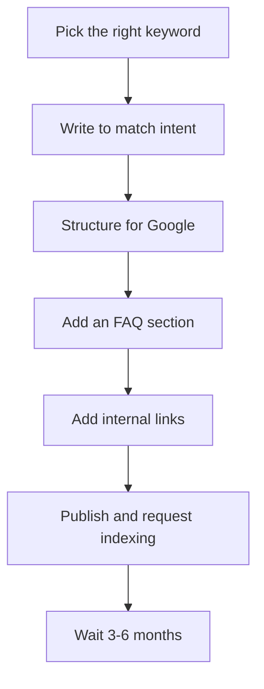

SEO for beginners does not have to be complicated. There are about eight things that actually determine whether your post ranks or sits invisible on page 10 — and six of them you can do in the hour you spend writing. This guide walks through all of them in order.

## The ranking workflow at a glance

Before the detailed steps, here is the whole process in order:



## Step 1: Pick the right keyword before you write a single word

Keyword selection is the highest-leverage decision in SEO. A post targeting the wrong keyword will fail no matter how good it is.

**What makes a keyword "right" for a beginner:**
- **Monthly search volume of 100–2,000.** Zero-search keywords are not worth writing. But competing for a keyword like "AI tools" (1M+ searches) as a new site is also a losing bet — the top results have thousands of backlinks.
- **Low competition.** Open a private browser window, search your keyword, and look at page one. If results are all Wikipedia, Forbes, and Reddit — it is too competitive. If some results are smaller blogs with specific posts — you have a chance.
- **Clear search intent.** The reader who types your keyword wants one specific thing: a list, a how-to, a comparison, or an answer. Your post must give them exactly that, or Google will not rank you even if everything else is perfect.

**Free tools for keyword research:**
- Google autocomplete (type your topic and see what Google suggests)
- "People also ask" boxes in search results
- Google Trends to check if a topic is growing or shrinking
- Ahrefs free tier (10 keyword lookups/month)

## Step 2: Write the post around the keyword — not vice versa

Once you have your keyword, structure the post to match what someone typing that phrase actually wants.

**Where to include the keyword:**
- In the title tag (ideally near the front)
- In the first 100 words of the post body
- In at least one H2 subheading
- In the URL slug (short, clean, no stop words)
- In the meta description

**Where NOT to stuff it:** everywhere else. "Keyword density" is not a ranking factor. Write for the reader. One natural mention per section is plenty.

::: warning
Do not keyword-stuff. "Keyword density" is not a ranking factor, and a post that repeats the phrase 20 times but ignores search intent will still not rank.
:::

**Intent matching example:** If someone searches "best AI tools for writing," they want a list with recommendations. Publishing a post that is purely definitional ("AI writing tools are software programs that...") will not rank for that query — even if the keyword appears 20 times.

## Step 3: Structure the post so Google can parse it

Google does not read your post like a human — it parses structure. Help it.

- **One H1 (your title).** Most CMSs set this automatically from your post title.
- **H2 for main sections, H3 for sub-sections.** Do not skip levels. Do not use headings just to break up visual space.
- **Descriptive URL slug.** Use `/seo-for-beginners`, not `/post-12345`. Keep it under 60 characters if possible.
- **Meta description under 155 characters.** This shows in search results. Write it to earn the click, not to rank — it does not affect ranking directly, but it drives click-through rate, which does.
- **One image per post minimum, with a descriptive alt text.** Alt text helps visually-impaired readers and tells Google what the image shows. Keep it factual: "screenshot of Google Search Console URL inspection tool" beats "best seo tool google."

## Step 4: Add an FAQ section

FAQ sections are the fastest path to earning featured snippets — the "answer box" at the top of Google results that shows before the first organic result.

Format: use a `##` H2 heading "Frequently asked questions," then bold the question, followed by a concise paragraph answer (2–4 sentences). Match the questions to what actually appears in "People also ask" for your keyword.

## Step 5: Internal links from other posts to this one

Internal linking is the most underused SEO lever for beginner bloggers. It does two things:

1. **Passes link equity.** Pages with more internal links pointing at them rank more easily.
2. **Tells Google what the page is about.** The anchor text of an internal link is a signal. "Click here" is useless. "AI tools for blogging" tells Google exactly what the destination page covers.

Once you publish, go to your 3–5 most-visited existing posts and add a contextually relevant sentence with a link to your new post. If you are just starting, add internal links in both directions when you publish each new post.

For a broader view of the SEO foundation your whole blog needs: [How to start an AI blog that ranks on Google](/posts/how-to-start-an-ai-blog-that-ranks-on-google/).

## Step 6: Technical basics (the short list)

- **HTTPS.** Required. Free via Let's Encrypt on almost every host.
- **Mobile-friendly.** Google indexes mobile-first. Test with Google's Mobile-Friendly Test.
- **XML sitemap.** Submit it in Google Search Console so Google knows your pages exist.
- **robots.txt.** Confirm it is not accidentally blocking Googlebot from crawling your posts.
- **Article structured data (JSON-LD).** Tells Google the type of content, authorship, and publication date. Well-built blog platforms add this automatically.

## Step 7: After you publish — the first 48 hours

```steps
1. Submit the exact URL in **Google Search Console → URL Inspection → "Request indexing"** so Google crawls it immediately instead of waiting weeks
2. Share the post on **one social channel** to bring initial traffic that signals the page is real and visited
3. Add **2–3 internal links** from your older posts to this new one (see Step 5)
```

## Step 8: Timeline and what to realistically expect

- **New sites:** expect 3–6 months before meaningful Google traffic. Google does not trust new domains overnight — this is normal and unavoidable.
- **First rankings:** almost always for long-tail variants of your target keyword, not the exact phrase.
- **When to update:** if a post has been indexed for 3+ months and is not appearing on pages 1–3 for any related phrase, update it with more depth, add FAQ items, and strengthen internal links. Then re-request indexing.

The trap most beginners fall into is abandoning a post after two weeks because it has no traffic. SEO results compound on a 3–6 month lag. Stay consistent.

::: note
New sites typically wait 3–6 months for meaningful Google traffic, and first rankings usually come from long-tail variants rather than your exact target keyword. This lag is normal — do not abandon a post early.
:::

## Frequently asked questions

**Is SEO free?**
The core techniques are free. Google Search Console (essential) is free. The main cost is time. Paid tools like Ahrefs or SEMrush help but are not necessary to rank — especially early on.

**Do I need backlinks to rank?**
Backlinks help significantly. But for low-competition keywords, a well-structured post with good on-page SEO and internal links can rank without any external backlinks. Build internal links first; pursue external ones as a secondary effort.

**How many posts do I need for Google to take my site seriously?**
There is no hard number, but 15–20 properly optimized posts gives Google enough to understand your site's topic focus. Quality matters more than quantity.

**Can AI write the SEO-optimized post for me?**
AI can produce a first draft and suggest keywords. But it cannot add your first-hand experience, original screenshots, or specific results — which are exactly what Google's Helpful Content system rewards. Use AI as a drafting tool, not as a replacement for your perspective.

## The bottom line

Ranking your first blog post requires: the right keyword, matched search intent, clean structure, an FAQ section, and internal links. Get those five right and you are ahead of most new bloggers. The rest — backlinks, domain authority — comes with time and consistency.

*Last updated: 2026-06-17.*
